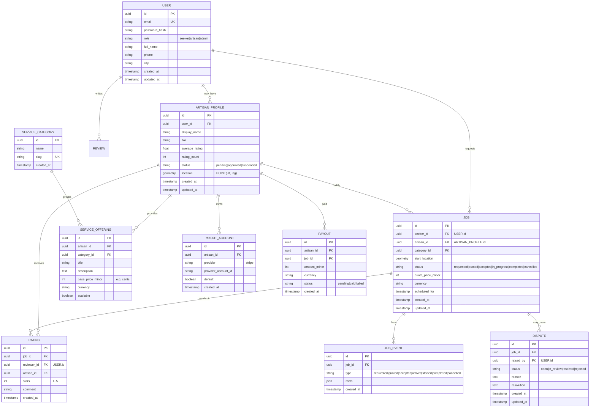

# QuickFix — ERD (Draft)

Notes:

- Monetary amounts stored in minor units (e.g., kobo/cents).
- `geometry` assumes PostGIS; fallback to `decimal lat/lng` if needed.
- `RATING` references both `job_id` and `artisan_id` for analytics.
- Stripe Connect recommended for payouts (see `PAYOUT_ACCOUNT`).
